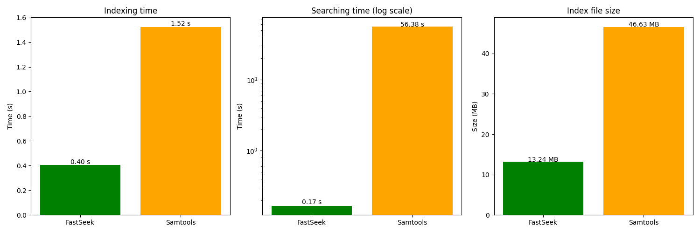
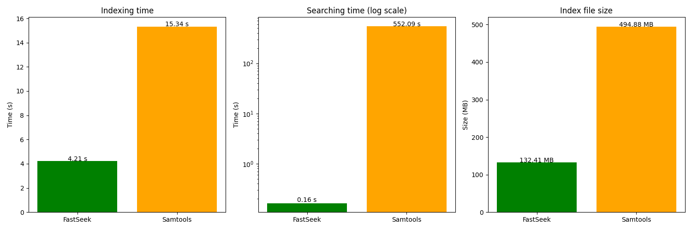

** In Development **

# FastSeek

FastSeek is a high-performance indexer and search tools for **tabular data** (csv, tsv), **multi-fasta** and **fastQ** files.

* **File-oriented**: FastSeek is designed to work with files, not databases. Plain-text files and compressed .gz files are supported.
* **As-fast-as-possible**: FastSeek is optimized for speed. It uses a combination of in-memory and on-disk indexing to run as fast as possible.
* **On-disk indexing**: while FastSeek will take advantage of the available RAM to speed up, it is designed to work with indexes that are larger than memory.
* **Small index files**: FastSeek uses a compact index format that is much smaller than the original data.

## Indexing
#### Tabular files:
```bash
fastseek index-tabular --column <COLUMN> --separator <SEPARATOR> <default '\t'> <options> <FILENAME>
```
* Separator defaults to tab if not specified.

#### Multi-fasta files:
```bash
fastseek index-fasta <--by-sequence> <options> <FILENAME>
```
* `--by-sequence` indexes by sequence instead of by header.

#### FastQ files:
```bash
fastseek index-fastq <--by-sequence> <options> <FILENAME>
```
* `--by-sequence` indexes by sequence instead of by header.

### Additional options:
* `--hashmap-size <SIZE>`: number of entries for the hashmap. If 0, defaults to the number of entries in the original file.
    * **Note:** specifying this value to the size of the original file will speed up the process compared to leaving it at 0.
* `--in-memory-map-size <SIZE>`: max size of the in-memory hashmap - in number of entries. Each entry takes up 8 bytes. Defaults to 2M.
    * **Note:** higher values lead to greater speed.

## Searching
```bash
fastseek search <ORIGINAL_FILENAME> <QUERY>
```
The filename must be the original filename used to create the index. FastSeek will look for the index file in the same directory.

# Benchmarking
** In Development **

This section presents some benchmarks comparing FastSeek to other tools.

Benchmarks can be run using the Snakefile in the repository root. The conda environment to run the benchmarks is specified in the benchmark_env.yaml file.

## FastQ, FastSeek vs Samtools faidx
*Note: comparing to Samtools faidx is not entirely fair, as it is not designed for speed over large files. faidx generates a .fai index which require linear search. However, it is a common tool for this task.*

General conditions:
* FastQ input file.
* 100 queries, from random sequences in the file.
* Default settings for Samtools faidx.
* --hashmap-size 1.000.000 for FastSeek.

#### Results with 1.000.000 reads in the FastQ file:



#### Results with 10.000.000 reads in the FastQ file:



As expected, FastSeek is much faster than Samtools faidx. The difference in search time increases with the size of the file, as Samtools faidx requires linear search while FastSeek uses a hashmap.